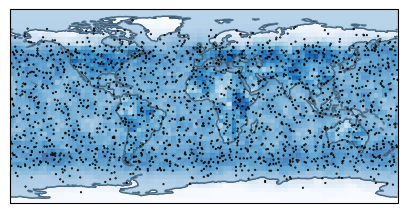
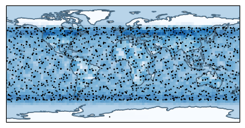
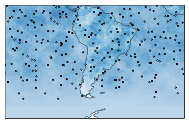

## Figure 14: TinyLEO on-demand sparse LEO network

<div align=center></div>


### Overview

The three figures shows TinyLEO’s sparse LEO network layout to match differnts demands. Compared to Starlink’s 6,793 satellites,TinyLEO shrinks its network size to 1,763 (3.9×), 3,344 (2.0×), and 1,066 (6.4×) satellites to meet the same broadband demands for Starlink’s customers, Internet backbone backup, and Latin America, respectively.

### Experimental methodology
 
We use on-demand network sparsification with diverse yet sparse Earth-repeat ground tracks to shrink the size of mega-constellation. The three figures visualize constellations synthesized by TinyLEO:
 
 - Figure 14a: 1,763 satellites for official Starlink customers
 - Figure 14b: 3,344 satellites for Internet backbone backup
 - Figure 14c: 1,066 satellites for Latin America

### How to run the code

```
jupyter notebook
open figure14ab.ipynb file or figure14c.ipynb and run notebook
```

### Data

The following data files can be found in the `data/` subfolder:

	|- data
		|- plot_cell_one_degree.npy: Network demand for official Starlink customers
        |- satellite_demand_backbone_network.npy: Network demand for Internet backbone backup
        |- TinyLEO_for_backbone_network.npy: Orbital parameters of the constellation designed for backbone network
        |- TinyLEO_for_Latin_America.npy: Orbital parameters of the constellation designed for Latin America
        |- TinyLEO_for_starlink_demand.npy: Orbital parameters of the constellation designed for official Starlink customers

