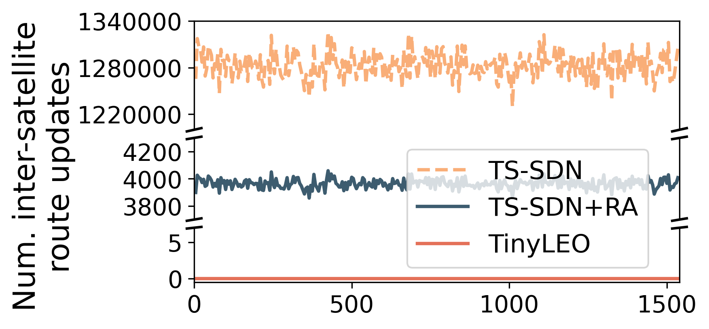
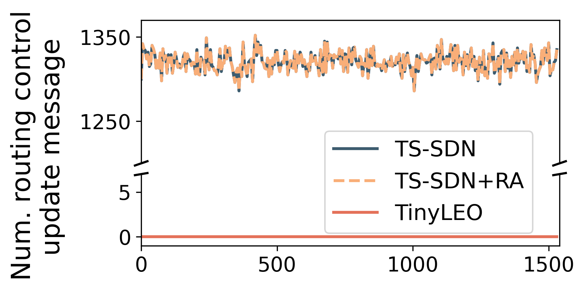
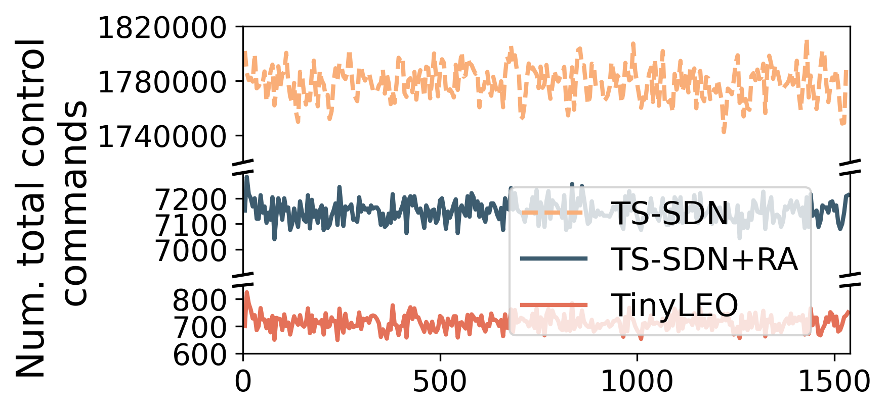
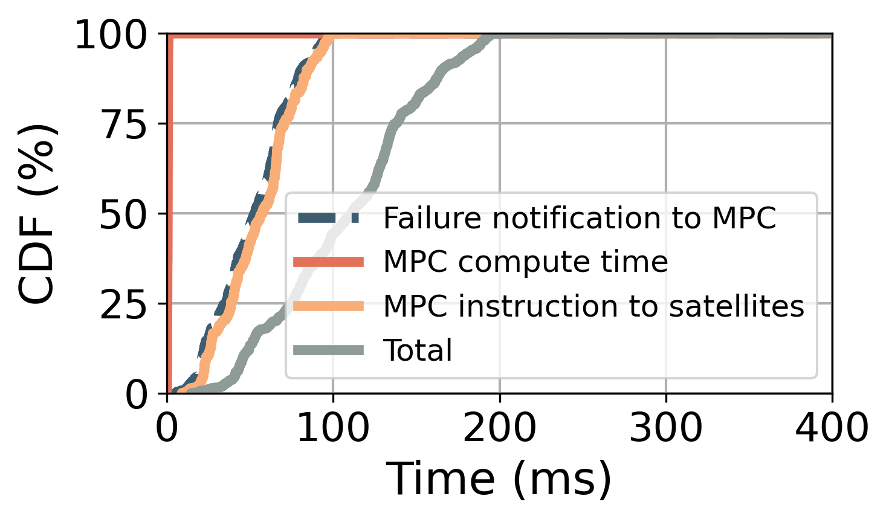

## Figure 17: TinyLEO’s control-plane efficiency and cost

<div align=center></div>

### Overview
The four figures measure the number of signaling messages from the controller to all satellites under the time-evolving topology. As shown in Figure 17a, TinyLEO’s stable topology intent prevents frequent updates of geographic routes under LEO dynamics, thus eliminating inter-satellite routing control updates. Instead, TS-SDN suffers from high inter-satellite routing control costs even with route aggregation (RA), because TinyLEO’s non-uniform layout makes the satellite routing less hierarchical. In TinyLEO’s sparse LEO network, this results in 1–3 orders of magnitude saving of total signaling messages for TinyLEO compared to TS-SDN. The remaining control messages in TinyLEO are mostly for each satellite’s local ISL updates to enforce geographic topology intents. They are 10× fewer than those in Figure 16 since each ISL change will incur multiple inter-satellite route changes. Figure 17d demonstrates the time TinyLEO’s orbital MPC takes to repair the topology by injecting 1,000 random link failures.

### Experimental methodology

**Figure 17a-c** We compared TinyLEO's control plane with Aalyria's open-source TS-SDN implementation. We tracked control-plane overhead by collecting topology snapshots at 60-second intervals over a 12-hour period for our 1,763-satellite network matched to the geographic mesh grid topology intent in figurel6b. For each snapshot transition, we computed required updates, including ISL establishments/terminations and routing table changes. We measured three metrics: inter-satellite route updates (17a), routing control messages (17b), and total signaling overhead (17c).
**Figure17d** We evaluate TinyLEO's failure recovery performance by injecting 2,000 random link failures across the network. For each failure, we measure four time components: (1) failure notification time - delay for failure information to reach the MPC controller; (2) MPC computation time - processing required to calculate new topology; (3) deployment time - delay to distribute new configuration to affected satellites; and (4) total recovery time. All measurements account for realistic network propagation delays based on physical distances between satellites and the ground controller.


### How to run the code

```
jupyter notebook
open figure17.ipynb file and run notebook
```

### Data

The following data files can be found in the `data/` subfolder:

	|- data
        ├── link_failure_recovery_results.npy
        ├── tiny_leo_overhead_573_11_11_distancedt_global_max_new.npy
        ├── topology_changes_573_11_11_distancedt_global_max.npy
        └── ts_sdn_overhead_573_11_11_distancedt_global_max_new.npy