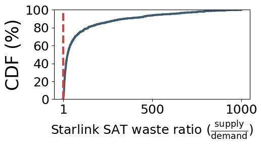
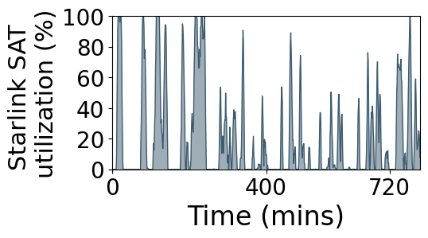

## Figure 4: LEO network resource waste under mobility

<div align=center></div>


### Overview

The two figures shows that LEO mega-constellation with uniform satellite distribution are wasted significantly, especially under mobility. Most of them are unavoidably exposed in areas with few users and left idle most of the time. Due to their fast mobility, LEO satellites that cover hotspots for now will soon leave. To meet excessive demand in these hotspots, LEO networks must ensure that there are always enough satellites covering these areas, which, however, leads to more satellite capacity waste elsewhere as they will move from hotspots to low-demand areas.

### Experimental methodology

- Figure 4 left: Based on the trajectories of Starlink satellites from [space-track.org](https://www.space-track.org/), we compute each satellite's bandwidth supply to each ground cell as it passes overhead, and assess the satellite waste ratio as the ratio of supply to demand.
- Figure 4 right: We track a Starlink satellite's trajectory, compute its bandwidth supply to each ground cell as it passes overhead, and assess its utilization over a 12-hour period.

### How to run the code

```
jupyter notebook
open figure4.ipynb file and run notebook
```

### Data

The following data files can be found in the `data/` subfolder:

	|- data
		|- 2025_01_01_starlink.npy: Position data of Starlink satellites (2025-01-01)
		|- starlink_user_distrubution.npy: Starlink's user distribution

