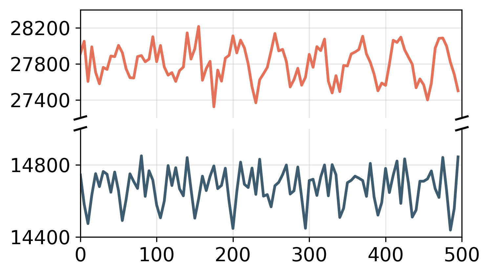
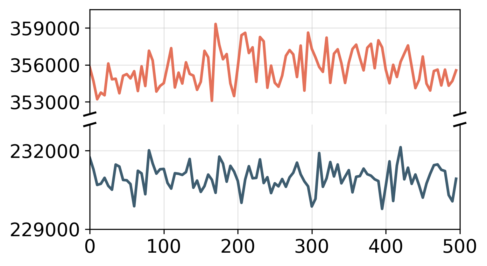

## Figure 9: Dynamic non-uniform LEO physical network

### Overview

The two figures show the impacts of the non-uniform LEO physical dynamics on topology and routing, projecting the update frequency of all potential ISLs and shortest paths among satellites in TinyLEO and uniform LEO networks of the same size. Due to heterogeneous satellite motions by diverse orbital parameters, the sparse LEO network will inevitably encounter more ISL and route changes than the uniform one.

### Experimental methodology

- Figure 9a: This figure projects update frequency of all potential ISLs in TinyLEO and uniform LEO networks of the same size (Starlink's shell 2 and shell 3 constellation). An ISL is considered establishable when the distance between two satellites remains below the maximum visibility threshold. If this condition is violated in the subsequent time step, the ISL is considered broken and is accordingly updated.

- Figure 9b: This figure projects update frequency of shortest paths in TinyLEO and uniform LEO networks of the same size (Starlink's shell 2 and shell 3 constellation). We compare shortest paths between fixed source–target pairs at consecutive time steps and counting those that change.

### How to run the code

**Step 1:** Open and run the following notebooks for data pre-processing:

- `data_prepare_uniform_constellation.py`

- `data_prepare_nonuniform_constellation.py`

The intermediate results will be saved in the `data/` subfolder.

**Step 2:** Open and run the `figure9.ipynb` notebooks to visualize the results:

### Data

The following data files can be found in the `data/` subfolder:

    |- data
        ├── shell2_TLE: TLE data for Starlink’s shell 2 constellation
        ├── shell3_TLE: TLE data for Starlink’s shell 3 constellation
        ├── nonuniform_isls.npy: Inter-satellite link breakages over time in the non-uniform constellation
        ├── nonuniform_paths.npy: Routing path changes over time in the non-uniform constellation
        ├── uniform_isls.npy: Inter-satellite link breakages over time in the uniform constellation
        └── uniform_paths.npy: Routing path changes over time in the uniform constellation
