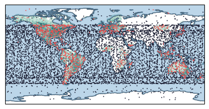
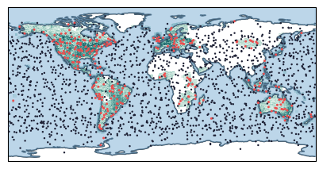

## Figure 1: Small LEO network for enormous demands

<div align=center></div>


### Overview

These two figures shows LEO network layouts of Starlink mega-constellation (Figure 1a) and TinyLEO (Figure 1b), respectively. 

As shown in Figure 1, the global network demands are uneven, with over 70% of users concentrated in 5% of the land and very few users in oceans covering 70.8% of the Earth. However, today's mega-constellation are  typically evenly distributed (Figure 1a). This physical mismatch has wasted most satellites in low-demand areas. Thus, by accurately matching the sparse LEO network supply with uneven global demands, our solution, TinyLEO, significantly cut satellites and shrink the size of the constellation by 3.9× (Figure 1b). 

### Experimental methodology

- For Figure 1a, we use the real-world layout of the leading LEO mega-constellation, consisting of 6,793 satellites across 5 orbital shells as of January 2025. We extract the actual satellite distribution from public orbital trajectory data published by space-track.org and plot them.

- For Figure 1b, we visualize the constellation synthesized by TinyLEO, which consists of only 1,763 satellites,meeting the same network demand of Starlink.

### How to run the code

```
jupyter notebook
open figure1.ipynb file and run notebook
```

### Data

The following data files can be found in the `data/` subfolder:
```
|- data
    |- 2025_01_01_starlink.npy: Position data of Starlink satellites (2025-01-01)
    |- TinyLEO_for_starlink_demand.npy: Postion data of constellation synthesized by TinyLEO
    |- plot_demand_one_degree.npy: Ground user distribution (1°×1° resolution) for heatmap
    |- plot_demand.npy: Ground user distribution for satellite coloring (0.4° grid)
```