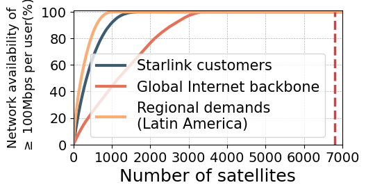

## Figure 15: LEO network sparsification in TinyLEO

<div align=center></div>
<div align=center></div>
<div align=center></div>

### Overview

**Overall LEO network sparsification:** Figure 15a compares size of constellations synthesized by TinyLEO with other solutions for different network demands. These saving is attributed to TinyLEO’s supply-demand matching for lower LEO satellite waste (Figure 15b). 

**More savings with flexible network availability**: Our experiments further find that the marginal benefits of adding more satellite diminish over the LEO network scale, as shown in Figure 15c–15d. 

**Impact of orbital parameters:** Figure 15e characterizes the diverse orbital parameters in TinyLEO’s network layout in Figure 14.

### Experimental methodology
- **Figure 15a&b:** We compare TinyLEO with three candidate solutions: (1) *Starlink*, the leading LEO mega-constellation network with 6,793 satellites in 5 orbital shells as of 2025.01 (Figure 1a). (2) *MegaReduce*[1][2], which fine-tunes uniform LEO mega-constellations by iteration to save satellites; (3) *Gurobi*, which implements exact solution of Equation 2–4 using Gurobi v12.0[3]  and runs it over a high-performance workstation with 2 Intel Xeon Gold 6430 CPUs (2.1–3.4 GHz, 32 cores, 64 threads, and 60MB cache for each) and 1 TB DDR5-4800 RAMs for its multi-thread acceleration. Despite such powerful computing, this workstation still cannot finish a single run of this integer pro- gramming within 2 months. We truncate each run after 2 months and present the minimal LEO network size it obtains.
- **Figure 15c:** TinyLEO synthesizer adopts a greedy iterative selection process to form a constellation until demand is satisfied. We track how network availability improves as satellites are incrementally added by calculating the cumulative number of demands satisfied.
- **Figure 15d:** We collect Cloudflare’s DNS-based Starlink user activity measurements over 2 days at 15-minute intervals across cities. Then, we compares the size of TinyLEO’s LEO network to meet Starlink customers with/without considering their diurnal activities.
- **Figure 15e:** We follow [4] to calculate the importance score of each orbital param-
eter in on-demand LEO network sparsification. We also characterize the diverse orbital parameters in TinyLEO’s network layout for official starlink customers.

### How to run the code

**Step 1:** Open and run the following notebooks for data pre-processing:

- `data_prepare_starlink_customers.ipynb`  
- `data_prepare_backbone.ipynb`  
- `data_prepare_Latin_America.ipynb`

The intermediate results will be saved in the `data/` subfolder.

**Step 2:** Open and run the following notebooks to generate the final results and produce the figures:

- `figure15a&c.ipynb`  
- `figure15b.ipynb`  
- `figure15d.ipynb`  
- `figure15e.ipynb`


### Data

The following data files can be found in the `data/` subfolder:
```
data/
├── 2025_01_01_starlink.npy                    : Starlink satellite positions on 2025-01-01  
├── backbone_satellite_demand.npy              : Bandwidth demand for global Internet backbone  
├── cloudflare_over_time_0708.npy              : Diurnal variation of user activity from Cloudflare (July 8)  
├── MegaReduce_backbone.npy                    : MegaReduce result for backbone demand  
├── MegaReduce_official_demand.npy             : MegaReduce result for official Starlink demand  
├── MegaReduce_South_America.npy               : MegaReduce result for Latin America demand  
├── network_availability_backbone_demand.npy   : Network availability under backbone demand  
├── network_availability_Latin_America_demand.npy : Network availability under Latin America demand  
├── network_availability_official_demand.npy   : Network availability under official Starlink demand  
├── random_forest/
│   ├── Backbone_params_mix.npy                : Candidate orbital parameters for backbone  
│   ├── Latin_America_params_mix.npy           : Candidate orbital parameters for Latin America  
│   ├── Selected_params_backbone.npy           : TinyLEO-selected parameters for backbone  
│   ├── Selected_params_Latin_America.npy      : TinyLEO-selected parameters for Latin America  
│   ├── Selected_params_starlink_customers.npy : TinyLEO-selected parameters for Starlink users  
│   └── Starlink_customers_params_mix.npy      : Candidate orbital parameters for Starlink users  
├── south_america_starlink_demand_99449.npy    : Starlink demand distribution in Latin America  
├── supply_demand_ratio_backbone_megareduce.npy : Supply/demand ratio for backbone (MegaReduce)  
├── supply_demand_ratio_backbone.npy           : Supply/demand ratio for backbone (TinyLEO)  
├── supply_demand_ratio_backbone_starlink.npy  : Supply/demand ratio for backbone (Starlink baseline)  
├── supply_demand_ratio_official_megareduce.npy : Supply/demand ratio for Starlink (MegaReduce)  
├── supply_demand_ratio_official.npy           : Supply/demand ratio for Starlink (TinyLEO)  
├── supply_demand_ratio_official_starlink.npy  : Supply/demand ratio for Starlink (baseline)  
├── supply_demand_ratio_south_megareduce.npy   : Supply/demand ratio for Latin America (MegaReduce)  
├── supply_demand_ratio_south.npy              : Supply/demand ratio for Latin America (TinyLEO)  
├── supply_demand_ratio_south_starlink.npy     : Supply/demand ratio for Latin America (Starlink baseline)  
├── TinyLEO_for_backbone_network.npy           : TinyLEO constellation for backbone demand  
├── TinyLEO_for_diurnal_pattern.npy            : TinyLEO constellation under diurnal demand variation  
├── TinyLEO_for_Latin_America.npy              : TinyLEO constellation for Latin America  
├── TinyLEO_for_starlink_100.npy               : TinyLEO constellation for official Starlink user demand (100% demand satisfied)
└── Tinyleo_for_starlink_demand.npy            : TinyLEO constellation for official Starlink user demand  

```

### References
[1] Zeqi Lai, Yibo Wang, Hewu Li, Qi Zhang, Yunan Hou, Jun Liu, and Yuanjie Li. Your Mega-Constellations Can be Slim: A Cost-Effective Approach for Construct- ing Survivable and Performant LEO Satellite Networks. In IEEE International Conference on Computer Communications (INFOCOM’24). IEEE, 2024.

[2] Open-source code of MegaReduce. https://github.com/SpaceNetLab/MegaReduce, Retrieved 2024-12-01.

[3] Gurobi Optimizer. https://www.gurobi.com/, Retrieved 2025-01-17.

[4] Feature Importance with Random Forests. https://www.geeksforgeeks.org/feature-importance-with-random-forests/, Retrieved 2025-01-23.
