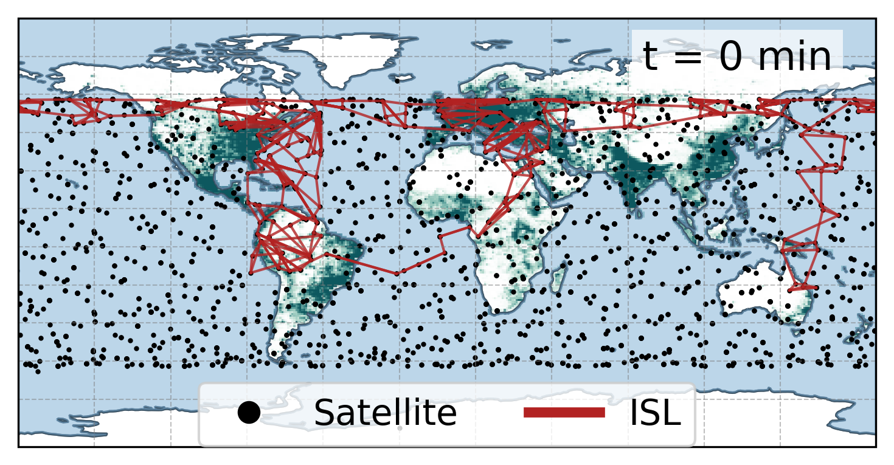
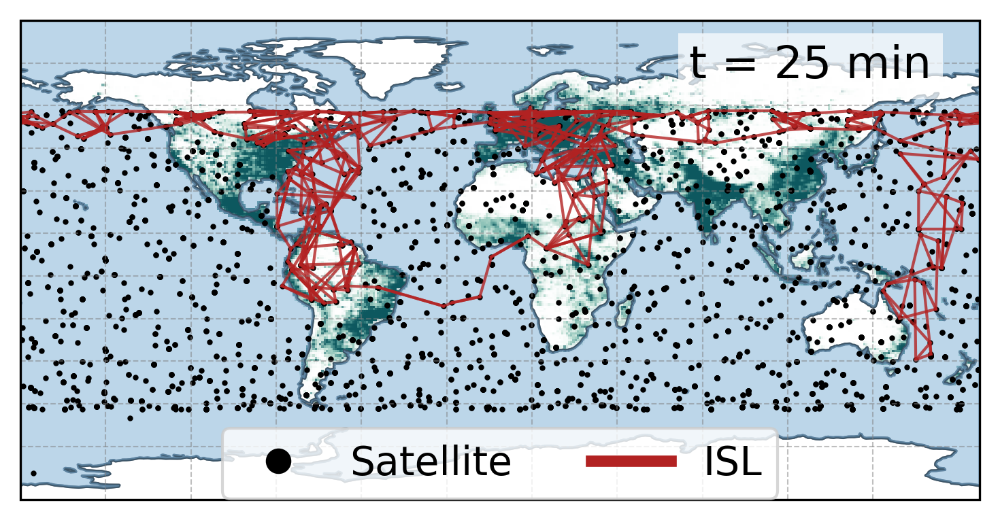
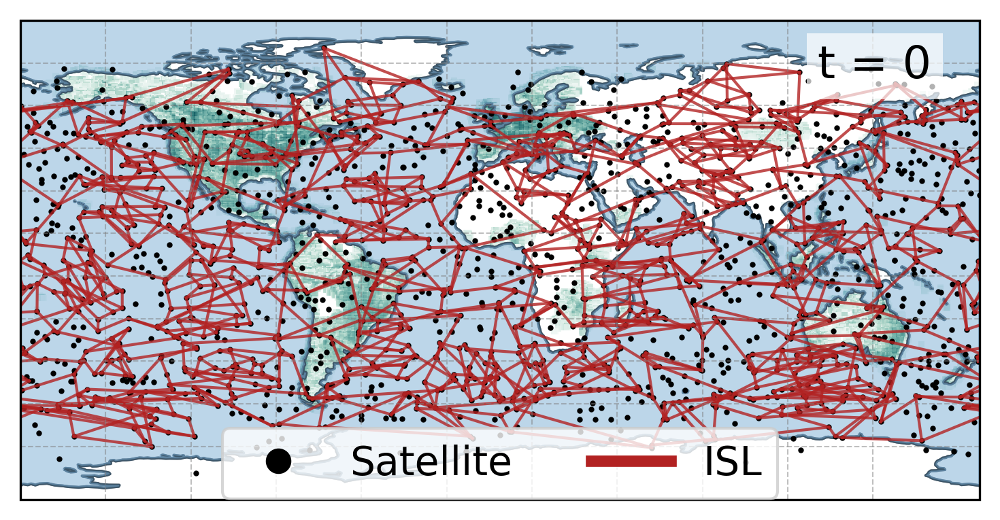
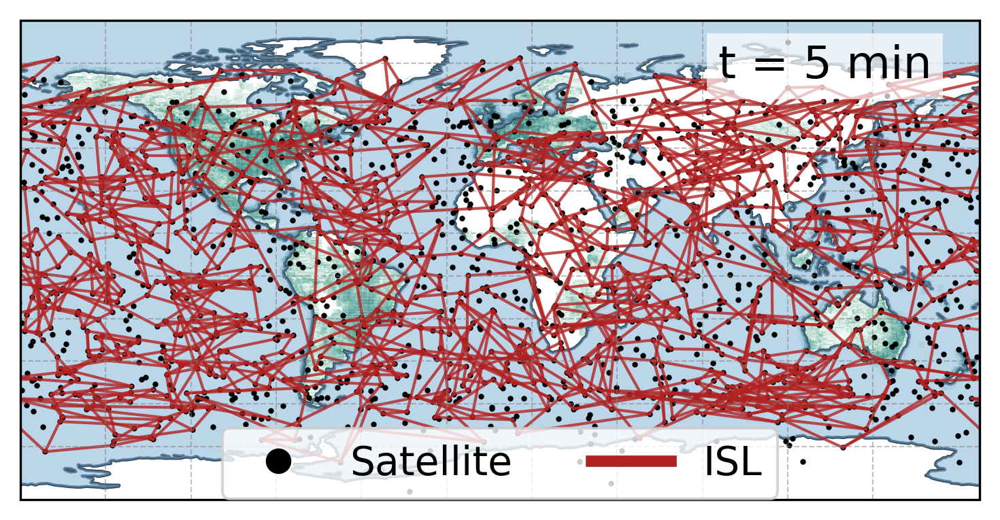

## Figure 16: Dynamic enforcement of topological intents

<div align=center></div>

### Overview

The four figures showcase TinyLEO’s dynamic enforcement of the Internet backbone intent and a geographic mesh topology intent over the sparse LEO network. For both intents, despite extreme satellite mobility, TinyLEO’s orbital MPC can dynamically enforce the upper-layer stable topological intent by compiling it into time-evolving LEO physical network topologies. The geographic topology intent remains fixed in this process, allowing the network operator to optimize its traffic engineering policy on a stable basis. 

### Experimental methodology

We utilize TinyLEO’s **geographic northbound API** to implement geographic traffic engineering intent (Internet backbone topology intent in figure 16a, geographic mesh grid topology intent in figure16b), specify and test versatile topology, routing, and traffic engineering policies in LEO satellite networks. We then use TinyLEO’s **orbital MPC** to dynamically enforce the upper-layer stable topological intent by compiling it into time-evolving LEO physical network topologies. 
 
Implementation details are available in the [TinyLEO toolkit](https://github.com/TinyLEO-toolkit/TinyLEO).

### How to run the code

```
jupyter notebook
open figure16.ipynb file and run notebook
```

### Data

The following data files can be found in the `data/` subfolder:

	|- data
        ├── all_inter_topology_573_11_11_distancedt_flow_20.npy: Inter-cell topology data (backbone network)
        ├── all_inter_topology_573_11_11_distancedt_global_20.npy: Inter-cell topology data (global routing)
        ├── all_intra_topology_573_11_11_distancedt_flow_20.npy: Intra-cell topology data  (backbone network)
        ├── all_intra_topology_573_11_11_distancedt_global_20.npy: Intra-cell topology data (global routing)
        ├── plot_demand.npy: User demand distribution data
        ├── TinyLEO_backbone_constellation_satellite.npy: Satellite locations of the TinyLEO constellation serving backbone network demand
        └── TinyLEO_constellation_satellite.npy: Satellite locations of the TinyLEO constellation serving Starlink's user demand
