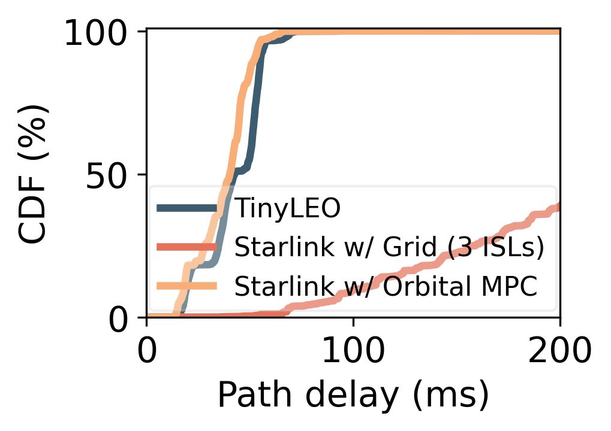
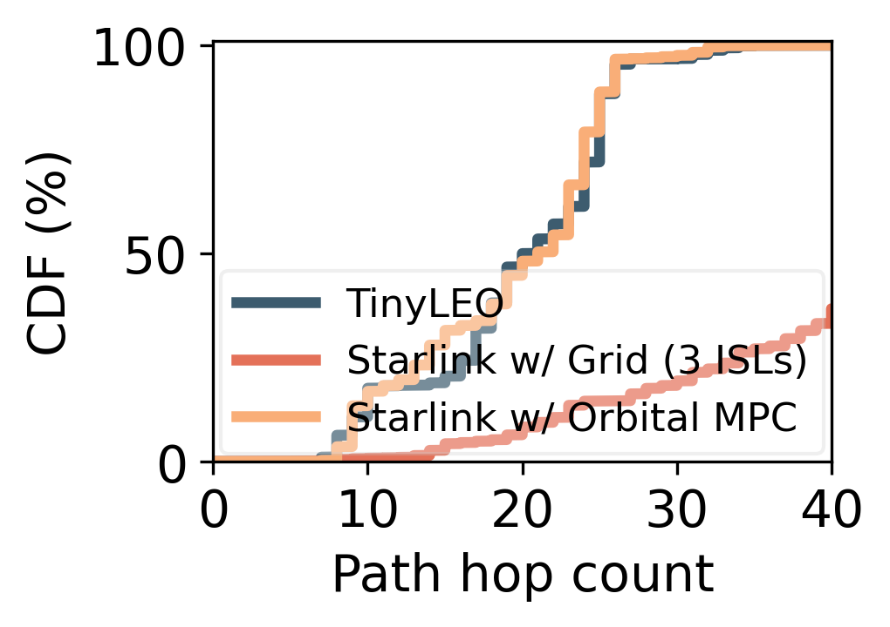
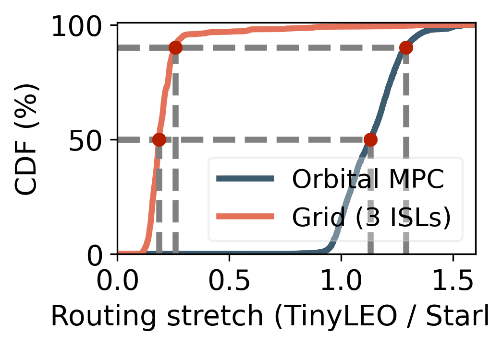
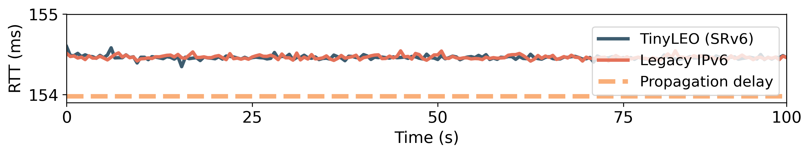
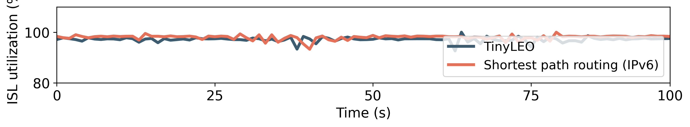
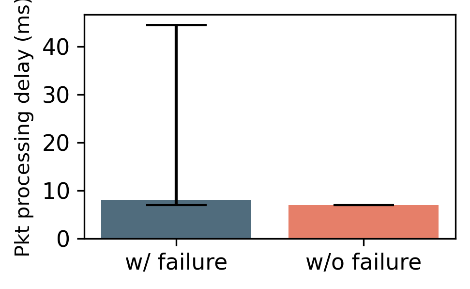

## Figure 19: TinyLEO’s data-plane performance

<div align=center></div>


### Overview
These figures present TinyLEO’s data-plane performance. 
- Figure 19a shows that TinyLEO achieves significantly lower routing stretches—1.29 at the 90th percentile and 1.63 at maximum—compared to Starlink, when both adopt the same orbital MPC for topology realization.

- Figure 19b evaluates TinyLEO’s end-to-end RTT and throughput under shortest-path routing. Owing to its greedy, hop-by-hop geographic forwarding mechanism, TinyLEO closely approximates the shortest paths while complying with high-level routing policy constraints.

- Figure 19c demonstrates that TinyLEO leverages Linux’s in-kernel SRv6 support to enable satellite routers to process and forward packets with efficiency comparable to legacy IPv6, achieving near full link utilization.

- Figure 19d further confirms that TinyLEO’s data-plane anycast capability can locally bypass failed or congested links and reroute traffic via alternative ISLs between geographic cells.

### Experimental methodology

- Figure 19a: we run TinyLEO over the backbone traffic demand and the shortest path intent for all its origin-destination pairs. We compare each origin-destination pair’s routing path length (in hop counts and propagation delays) in TinyLEO and Starlink under the same setting.  Since Starlink does not disclose its topology, we consider two candidate solutions for it: the standard 3-ISL grid topology (i.e., each satellite connects to its two nearest intra-orbit neighbors and one nearest inter-orbit neighbor), and the orbital MPC-based topology compilation.

- Fiure 19b: We characterize TinyLEO’s packet forwarding performance by measuring TinyLEO’s end-to-end RTT and throughput when enforcing the shortest-path routing.

- Figure 19d: We inject random ISL and satellite failures into our testbed and assess TinyLEO’s robustness to them.

See [TinyLEO toolkit](https://github.com/TinyLEO-toolkit/TinyLEO/tree/main/network_orchestrator) for implementation details.


### How to run the code

```
jupyter notebook
open the following files and run notebooks:
- figure19a.ipynb
- figure19b.ipynb
- figure19c.ipynb
- figure19d.ipynb
```

### Data

The following data files can be found in the `data/` subfolder:
```
|- data
    ├── pcap
    │   ├── with_failure.npy
    │   └── without_failure.npy
    ├── starlink_total_results_anycast.json
    ├── starlink_total_results_shortest_3isls.json
    ├── starlink_total_results_shortest.json
    ├── throughtput
    │   ├── ipv6_udp_throughput.txt
    │   └── srv6_udp_throughput.txt
    ├── tinyleo_total_results_anycast.json
    ├── tinyleo_total_results_shortest_3isls.json
    ├── tinyleo_total_results_shortest.json
    └── traceroutes
        ├── shorst_traceroute_srv6.txt
        └── shorst_traceroute.txt
```