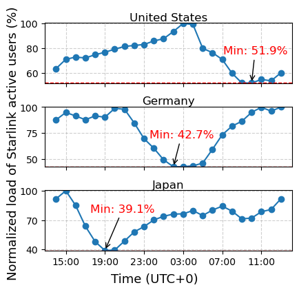

## Figure 3: Starlink’s global user traffic distribution based on Cloudflare’s public measurements

<div align=center></div>

### Overview

These two figures present the distribution of Starlink’s worldwide traffic based on Cloudflare’s DNS-based user activity measurements over 2 days at 15-minute intervals [1], which is in concert with Starlink’s official reports in [2] (see Figure 13a). It shows that Starlink users are more concentrated around a few regions than others, resulting in a long-tail distribution. Figure 3b also reveals periodic diurnal fluctuations of user activity across global time zones. It proves that LEO network users vary spatially and temporally.

### Experimental methodology

- Figure 3a: We collect DNS-based Starlink user activity measurements from Cloudflare over a 2-day period at 15-minute intervals. We then calculate the percentage of active users in each country and visualize representative countries, highlighting the spatial unevenness in user distribution.

- Figure 3b: Using the same DNS-based measurements, we normalize the hourly load of active Starlink users over a 1-day period and plot the resulting usage patterns.

### How to run the code

```
jupyter notebook
open figure3a.ipynb and figure3b.ipynb file and run notebook
```

### Data

The following data files can be found in the `data/` subfolder:

	|- data
		└── filtered_cloudflare_data.csv

### Reference

[1] Cloudflare Radar. SpaceX Starlink’s Traffic Worldwide. https://radar.cloudflare.com/traffic/as14593, year = Retrieved 2025-01-01.

[2] SpaceX. Starlink 2024 Progress Report. https://stories.starlink.com/. Also available at https://tinyurl.com/4c22k7d8.