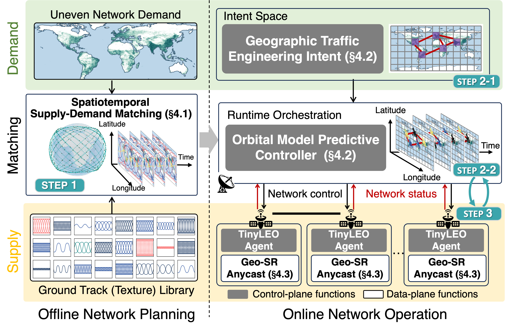

# Small-scale LEO Satellite Networking for Global-scale Demands

This repository collects the artifacts of the SIGCOMM'25 paper "Small-scale LEO Satellite Networking for Global-scale Demands."

## Overview
Do we really need 10,000s of Low Earth Orbit (LEO) satellites to meet huge global Internet demands? While proven feasible and valuable, such LEO mega-constellation networks have raised concerns about their prohibitive capital expenditures, market monopoly, and unsustainable use of space. Instead, our analysis reveals that most of their satellites can be wasted due to their mismatch with physically uneven demands. We thus propose TinyLEO[1], a software-defined solution to shrink LEO network size for enormous global demands via dynamic spatiotemporal supply-demand matching. TinyLEO sparsifies satellite supplies on demand by combining diverse yet sparse orbits, hides complexities of this sparse LEO network via orbital model predictive control, and shifts the responsibility for handling these complexities to its geographic segment anycast for higher network usability, lower resource wastes, faster failovers, simpler satellites, and more flexible network orchestration. We have prototyped TinyLEO as a community toolkit for open research. Our evaluation using this toolkit shows that TinyLEO can compress the existing LEO mega-constellation network size by 2.0–7.9×, cut control plane costs by 1–3 orders of magnitude, and maintain the same demands and comparable data plane performance.

<div align=center></div>

## This repository: reproducing results in paper[1]

Our open-source [TinyLEO community toolkit](github.com/TinyLEO-toolkit/TinyLEO) implements all features in [1]. This toolkit can be used to synthesize sparse LEO networks on demand and operate the resulting satellite networks. We recommend running this toolkit first to understand how TinyLEO works.

This repository then enables reviewers to reproduce the results reported in the paper[1]. It includes all datasets, figure scripts, and experiment configurations. Each figure folder under `Experimental-results/` contains a standalone `README.md` with instructions for reproducing the corresponding result.


## Repository structure

This repository includes the following contents:

	|- TinyLEO-SIGCOMM25
        ├── Dataset
        │   ├── Cloudflare-dataset: DNS-based Starlink user activity measurements from Cloudflare.
        │   └── Demand: LEO network demand from Starlink.
        ├── Experimental-results
        │   ├── figure1
        │   ├── figure14
        │   ├── figure15
        │   ├── ...
        ├── LICENSE
        ├── README.md: This file.
        ├── sigcomm25-tinyleo.pdf: The SIGCOMM'25 paper.
        └── tinyleo_overview.png: TinyLEO overview.
	
## Dataset


We use two datasets for the empirical study and evaluation (in `TinyLEO-SIGCOMM25/Dataset/`):

- **Cloudflare dataset**: The dataset is collected from Cloudflare, including:

    - `traffic_data_from_cloudflare_0707/`: DNS-based Starlink user activity measurements over 2 days (2025.07.06-2025.07.07) at 15-minute intervals across cities.
    - `400w_ip_country_city_250713.csv`: Starlink's active users distribution across cities at 2025.07.13.
 
- **LEO network demand dataset**: 
    - `starlink_supply_2025_01_01_99449.npy`: Starlink’s global customer distributions based on its [official report](https://x.com/SpaceX/status/1745941814165815717) and scale it by its total radio access link capacity (652 Tbps from 6,793 satellites avaliable at 2025.01.01) so that every user can gain a 100 Mbps downlink speed.
    - `satellite_demand_backbone_network.npy`: LEO network demand as [Internet backbone](https://global-internet-map-2022.telegeography.com) backup.
 
## Experimental Results

In `TinyLEO-SIGCOMM25/Experimental-results/`, we release the traces used in [1]'s figures, including
- `Figure1`: Small LEO network for enormous demands.
- `Figure 3`:Starlink’s global user traffic distribution based on Cloudflare’s public measurements.
- `Figure 4`: LEO network resource waste under mobility.
- `Figure 9`: Dynamic non-uniform LEO physical network.
- `Figure 14`: TinyLEO on-demand sparse LEO network.
- `Figure 15`: LEO network sparsification in TinyLEO.
- `Figure 16`: Dynamic enforcement of topological intents.
- `Figure 17`: TinyLEO’s control-plane efficiency and cost
- `Figure 19`: TinyLEO’s data-plane performance.


Each figure has a `README.md` in its corresponding folder that details the experimental methodology and how to run the code.

## Dependencies

To run all code in this repository, please use `python3 + jupyter notebook` and install the following packages:

```
pip3 install matplotlib numpy statsmodels pandas scipy seaborn
```

<!-- ## Raw dataset access
Due to excessive data volume, we do not intend to release all raw data here and put a sample in the dataset folder. If you want more data, please send a request to yuanjiel@tsinghua.edu.cn.

The request should include the work department, the purpose of data usage, and the data content obtained. -->

## Citation

Please indicate this repository when using it and cite our SIGCOMM paper [1].

## Contact

Please contact yuanjiel@tsinghua.edu.cn for any questions or technical support.

## References

[1] Yuanjie Li, Yimei Chen, Jiabo Yang, Jinyao Zhang, Bowen Sun, Lixin Liu, Hewu Li, Jianping Wu, Zeqi Lai, Qian Wu, Jun Liu. Small-scale LEO Satellite Networking for Global-scale Demands. To appear at ACM SIGCOMM 2025.

